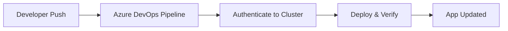
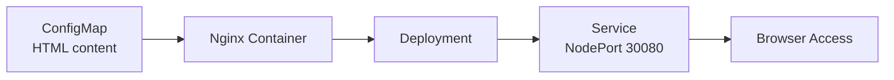

# k3s-assignment

# Summary:

This project demonstrates the automated provisioning of a single-node k3s Kubernetes cluster on an Azure Linux Virtual Machine using Terraform, followed by the automated deployment of a Hello World Nginx application using an Azure DevOps CI/CD pipeline.

# End-to-End Workflow

A push to the repository triggers the Azure DevOps pipeline, which runs on a Microsoft-hosted agent. The agent authenticates to the k3s cluster by pulling the kubeconfig from Azure DevOps Secure Files and pointing it at the VM's public IP. It then applies the manifests in `k8s/` and verifies the rollout with `kubectl`, after which the updated Hello World app is reachable on the NodePort.

# Infra Provision

1. Infrastructure provisioning was implemented using Terraform and provisions all required Azure resources necessary for:
  - Linux VM creation
  - Network connectivity
  - Security rules
  - Public accessibility
  - Automatic k3s installation
2. A static public IP was created so as to ensure a stable endpoint, mainly for Kubernetes API access. Without it when the VM restarts the IP changes and it breaks kubeconfig, Azure DevOps pipeline, browser URL access.
3. Network access was controlled using an NSG. Allowed rules:

  | Port  | Reason         |
  | ----- | -------------- |
  | 22    | SSH            |
  | 80    | HTTP           |
  | 6443  | Kubernetes API |
  | 30080 | Nginx NodePort |

4. The NIC connects the VM to networking resources. It acts as network attachment point and is responsible for subnet connectivity, public IP binding, NSG attachment.
5. Password authentication was disabled. SSH key authentication, standard DevOps practice, is used to improve security. Terraform inject the public key into the VM during provisioning.
6. VM executes the bootstrap script using the custom_data block. Azure automatically runs cloud-init at boot.

# Application Architecture

- Deployment architecture:  

- ConfigMap stores HTML content. It injects custom HTML without rebuilding container images.

# CI/CD Pipeline

- A simple CI/CD pipeline is designed to trigger when changes are pushed to the repository, and then apply the Kubernetes manifest for the Nginx application to the k3s cluster.
- kubeconfig is a Kubernetes authentication and cluster connection configuration file. It consists of information like the admin, credentials, client certs, contexts, certificate-authority-data, private key etc.
- k3s automatically creates kubeconfig during installation at /etc/rancher/k3s/k3s.yaml.
- kubeconfig was stored using Azure DevOps Secure Files to follow security best practices.
- Kubernetes credentials are fetched securely during the DownloadSecureFile@1 stage. Then the kubeconfig is copied from system location to user location (~/.kube/config), where kubectl looks automatically, to allow kubectl to authenticate and to avoid using sudo.
- kubeconfig's permissions are changed so that only owner can read and write and others cannot access it. 
- The server endpoint in the kubeconfig need to be updated to the VM's public IP so that kubectl knows where the Kube API server is.

# Outcome

- The Hello World Nginx application can accessed at "http://<VM's public IP>:30080".

